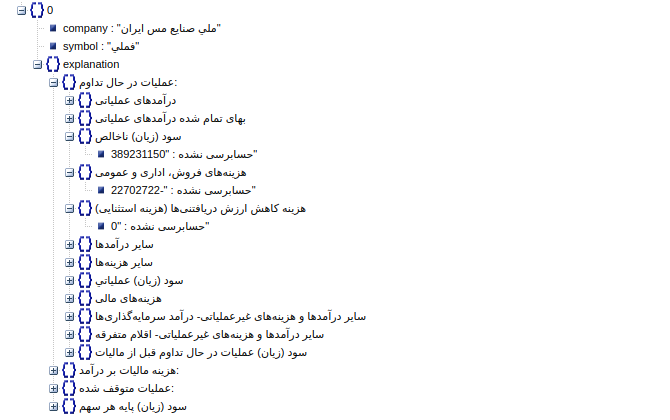

# Tehmart scraping by Scrapy

I made this project by [Scrapy](https://scrapy.org/) and [Django](https://www.djangoproject.com/) .

Screenshot :

# Run

## Create and activate virtual env

    python3 -m venv venv
    . ./venv/bin/activate

## Install dependencies

    pip install -r requirements.txt

## Check spiders contracts

    scrapy check codal

## Scrap

    scrapy crawl codal
